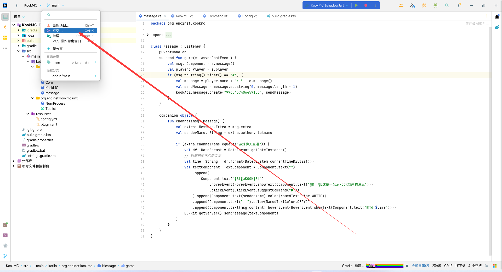

# 教程

## 安装git

去官网装就行 [https://git-scm.com/downloads](https://git-scm.com/downloads)

## clone

在指定文件夹打开git bash

<figure><figcaption><p>右键</p></figcaption></figure>

找到仓库链接的clone地址

<figure><figcaption></figcaption></figure>

在bash输入

```git
git clone <Clone地址>
```

输入之后会自动把项目克隆到本地

## IDEA git 使用

### Push

写完新的代码之后点提交

<figure><figcaption></figcaption></figure>

<figure><figcaption></figcaption></figure>

<figure><figcaption><p>效果如图</p></figcaption></figure>

### Pull

别人在写完代码之后可能会push到仓库，因此在开肝之前建议先pull一下。

<figure><figcaption></figcaption></figure>

这两个的区别我也不太清楚，但我选的一直都是第一个

<figure><figcaption></figcaption></figure>
